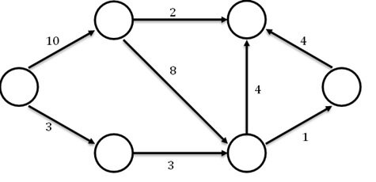

# 1. Úvod do grafů

- **Definice grafu**:
  - **Orientovaný**: Hrany mají směr (např. A -> B != B -> A)
  - **Neorientovaný**: Hrany jsou obousměrné (A-B == B-A)
  - **Ohodnocený**: Hrany mají váhu/cenu (např. vzdálenost, cena přenosu)

- **Kostra grafu**: Podgraf, který spojuje všechny vrcholy bez cyklů. Minimální kostra = nejmenší možná suma vah.

- **Reprezentace grafu**:
  - **Matice sousednosti**: 2D pole, kde `matrix[i][j]` = váha hrany mezi `i` a `j` (nebo 0/∞).
  - **Seznam sousedů**: Slovník/seznam, kde `adj_list[i]` obsahuje sousedy vrcholu `i` s jejich vahami.

- **Příklady využití**:
  - Navigace (nejkratší trasa), sociální sítě (vztahy), rozvrhování úkolů.

# 2. Problém nejkratší cesty

- **Nejkratší cesta**: Minimální suma vah hran mezi dvěma vrcholy.
- **Negativní hrany**: Mohou způsobit nekonečné zkracování (záporné cykly). Některé algoritmy je neumí (Dijkstra).

# 3. Přehled algoritmů

## a) Dijkstrův algoritmus
- **Princip**: Greedy přístup + prioritní fronta. Vždy expanduje nejbližší vrchol.
- **Omezení**: Pouze nezáporné hrany.
- **Složitost**: O((V+E) log V) s prioritní frontou.

## b) Bellman-Fordův algoritmus
- **Princip**: Relaxace všech hran V-1 krát. Zvládne i negativní hrany.
- **Detekce záporných cyklů**: Pokud po V-1 iteracích lze ještě relaxovat.
- **Složitost**: O(V*E).

## c) Floyd-Warshallův algoritmus
- **Princip**: Dynamické programování. Počítá nejkratší cesty mezi všemi páry.
- **Složitost**: O(V³). Vhodné pro malé grafy nebo všechny páry.

# Praktická část (návrh)
- **Algoritmus**: Dijkstrův algoritmus
- **Vstup**: Seznam hran jako `[(u, v, w), ...]` nebo matice.
- **Výstup**: Slovník `{v: vzdálenost}` od startovního vrcholu.
- Implementace: Nachází se ve složce src/

# Použitý graf pro testování

